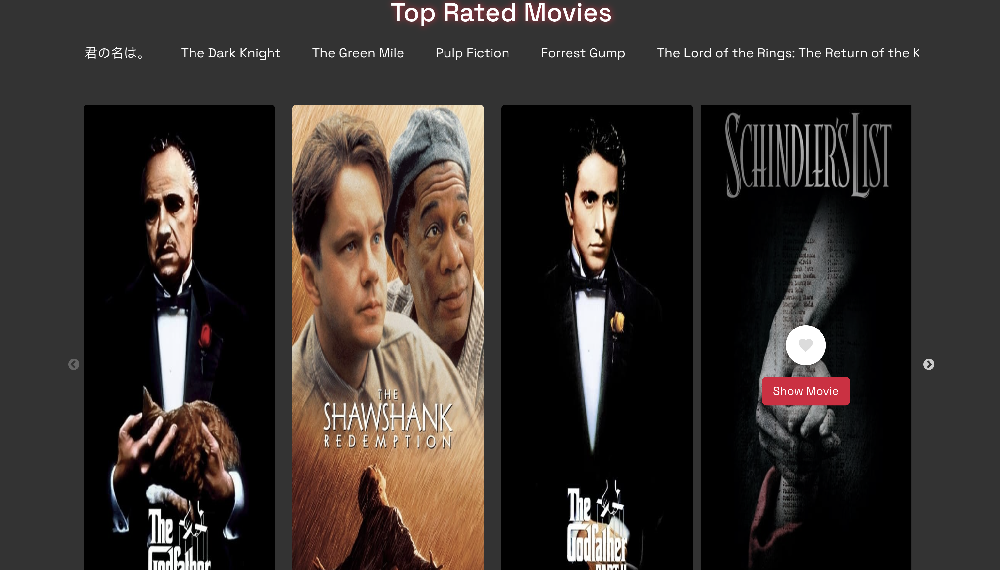

#MovieFlix Website

An integrated API website for many of movies and allow users for see each movie details in separated page

# Api sources:

- https://api.themoviedb.org/3/movie/popular?page=1&api_key=e5a319653f57fe3b2a8b69afa1a4377f

# About the website

The MovieFlix website includes the following pages:

- Home Page
- Movie Page
- Contact page
- Favourites Page
- Footer

# Technologies Used

- Typescript
- React Query
- React
- Redux
- Bootstrap
- Material UI
- React slick for slider

# Screenshots

# Project Link

https://movieflix-chi.vercel.app/
